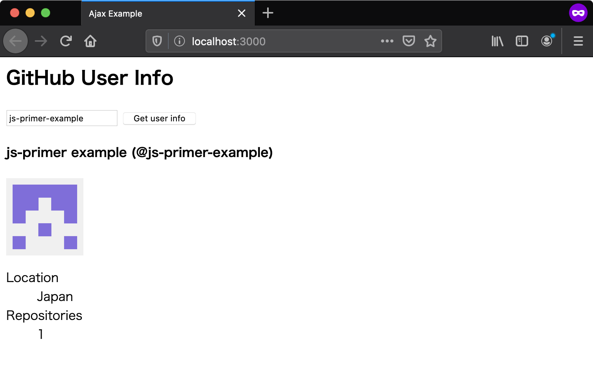

# Promiseを活用する {#use-promise}

ここまでのセクションで、Fetch APIを使ってAjax通信を行い、サーバーから取得したデータを表示できました。
最後に、Fetch APIの返り値でもある**Promise**を活用してソースコードを整理することで、エラーハンドリングをしっかり行います。

## 関数の分割 {#split-function}

まずは、大きくなりすぎた`fetchUserInfo`関数を整理しましょう。
この関数では、Fetch APIを使ったデータの取得・HTML文字列の組み立て・組み立てたHTMLの表示をしています。
そこで、HTML文字列を組み立てる`createView`関数とHTMLを表示する`displayView`関数を作り、処理を分割します。

また、後述するエラーハンドリングを行いやすくするため、アプリケーションにエントリーポイントを設けます。
`index.js`に新しく`main`関数を作り、`main`関数から`fetchUserInfo`関数を呼び出すようにします。

```js
function main() {
    fetchUserInfo("js-primer-example");
}

function fetchUserInfo(userId) {
    fetch(`https://api.github.com/users/${encodeURIComponent(userId)}`)
        .then(response => {
            if (!response.ok) {
                console.error("エラーレスポンス", response);
            } else {
                return response.json().then(userInfo => {
                    // HTMLの組み立て
                    const view = createView(userInfo);
                    // HTMLの挿入
                    displayView(view);
                });
            }
        }).catch(error => {
            console.error(error);
        });
}

function createView(userInfo) {
    return escapeHTML`
    <h4>${userInfo.name} (@${userInfo.login})</h4>
    
    <dl>
        <dt>Location</dt>
        <dd>${userInfo.location}</dd>
        <dt>Repositories</dt>
        <dd>${userInfo.public_repos}</dd>
    </dl>
    `;
}

function displayView(view) {
    const result = document.getElementById("result");
    result.innerHTML = view;
}
```

ボタンのclickイベントで呼び出す関数もこれまでの`fetchUserInfo`関数から`main`関数に変更します。

[import, title:"index.html"](./src/index.html)

## Promiseのエラーハンドリング {#error-handling}

次に`fetchUserInfo`関数を変更し、Fetch APIの返り値でもあるPromiseオブジェクトを`return`します。
この変更によって、`fetchUserInfo`関数を呼び出す`main`関数のほうで非同期処理の結果を扱えるようになります。
Promiseチェーンの中で投げられたエラーは、`Promise#catch`メソッドを使って一箇所で受け取れます。

次のコードでは、`fetchUserInfo`関数から返されたPromiseオブジェクトを、`main`関数でエラーハンドリングしてログを出力します。
`fetchUserInfo`関数の`catch`メソッドでハンドリングしていたエラーは、`main`関数の`catch`メソッドでハンドリングされます。
一方、`Response#ok`で判定していた400や500などのエラーレスポンスがそのままでは`main`関数でハンドリングできません。
そこで、`Promise.reject`メソッドを使ってRejectedなPromiseを返し、Promiseチェーンをエラーの状態にします。
Promiseチェーンがエラーとなるため、`main`関数の`catch`でハンドリングできます。

```js
function main() {
    fetchUserInfo("js-primer-example")
        .catch((error) => {
            // Promiseチェーンの中で発生したエラーを受け取る
            console.error(`エラーが発生しました (${error})`);
        });
}

function fetchUserInfo(userId) {
    // fetchの返り値のPromiseをreturnする
    return fetch(`https://api.github.com/users/${encodeURIComponent(userId)}`)
        .then(response => {
            if (!response.ok) {
                // エラーレスポンスからRejectedなPromiseを作成して返す
                return Promise.reject(new Error(`${response.status}: ${response.statusText}`));
            } else {
                return response.json().then(userInfo => {
                    // HTMLの組み立て
                    const view = createView(userInfo);
                    // HTMLの挿入
                    displayView(view);
                });
            }
        });
}
```

### Promiseチェーンのリファクタリング {#refactor-promise-chain}

<!-- textlint-disable ja-technical-writing/sentence-length -->

現在の`fetchUserInfo`関数はデータの取得に加えて、HTMLの組み立て（`createView`）と表示（`displayView`）も行っています。
`fetchUserInfo`関数に処理が集中して見通しが悪いため、`fetchUserInfo`関数はデータの取得だけを行うように変更します。
併せて`main`関数で、データの取得（`fetchUserInfo`）、HTMLの組み立て（`createView`）と表示（`displayView`）という一連の流れをPromiseチェーンで行うように変更していきます。

<!-- textlint-enable ja-technical-writing/sentence-length -->

`Promise#then`メソッドでつながるPromiseチェーンは、`then`に渡されたコールバック関数の返り値をそのまま次の`then`へ渡します。
ただし、コールバック関数の返り値がPromiseである場合は、そのPromiseで解決された値を次の`then`に渡します。
つまり、`then`のコールバック関数が同期処理から非同期処理に変わったとしても、次の`then`が受け取る値の型は変わらないということです。

Promiseチェーンを使って処理を分割する利点は、同期処理と非同期処理を区別せずに連鎖できることです。
一般に、同期的に書かれた処理を後から非同期処理へと変更するのは、全体を書き換える必要があるため難しいです。
そのため、最初から処理を分けておき、処理を`then`を使ってつなぐことで、変更に強いコードを書けます。
どのように処理を区切るかは、それぞれの関数が受け取る値の型と、返す値の型に注目するのがよいでしょう。
Promiseチェーンで処理を分けることで、それぞれの処理が簡潔になりコードの見通しがよくなります。

`index.js`の`fetchUserInfo`関数と`main`関数を次のように書き換えます。
まず、`fetchUserInfo`関数が`Response#json`メソッドの返り値をそのまま返すように変更します。
`Response#json`メソッドの返り値はJSONオブジェクトで解決されるPromiseなので、次の`then`ではユーザー情報のJSONオブジェクトが渡されます。
次に、`main`関数が`fetchUserInfo`関数のPromiseチェーンで、HTMLの組み立て（`createView`）と表示（`displayView`）を行うように変更します。

```js
function main() {
    fetchUserInfo("js-primer-example")
        // ここではJSONオブジェクトで解決されるPromise
        .then((userInfo) => createView(userInfo))
        // ここではHTML文字列で解決されるPromise
        .then((view) => displayView(view))
        // Promiseチェーンでエラーがあった場合はキャッチされる
        .catch((error) => {
            console.error(`エラーが発生しました (${error})`);
        });
}

function fetchUserInfo(userId) {
    return fetch(`https://api.github.com/users/${encodeURIComponent(userId)}`)
        .then(response => {
            if (!response.ok) {
                return Promise.reject(new Error(`${response.status}: ${response.statusText}`));
            } else {
                // JSONオブジェクトで解決されるPromiseを返す
                return response.json();
            }
        });
}
```

### Async Functionへの置き換え {#rewrite-to-async-function}

Promiseチェーンによって、Promiseの非同期処理と同じ見た目で同期処理を記述できるようになりました。
さらにAsync Functionを使うと、同期処理と同じ見た目でPromiseの非同期処理を記述できるようになります。
Promiseの`then`メソッドによるコールバック関数の入れ子がなくなり、手続き的で可読性が高いコードになります。
また、エラーハンドリングも同期処理と同じく`try...catch`構文を使うことができます。

`main`関数を次のように書き換えましょう。まず関数宣言の前に`async`をつけてAsync Functionにしています。
次に`fetchUserInfo`関数の呼び出しに`await`をつけます。
これによりPromiseに解決されたJSONオブジェクトを`userInfo`変数に代入できます。

もし`fetchUserInfo`関数の中で例外が投げられた場合は、`try...catch`構文でエラーハンドリングできます。
このように、あらかじめ非同期処理の関数がPromiseを返すようにしておくと、Async Functionにリファクタリングしやすくなります。

```js
async function main() {
    try {
        const userInfo = await fetchUserInfo("js-primer-example");
        const view = createView(userInfo);
        displayView(view);
    } catch (error) {
        console.error(`エラーが発生しました (${error})`);
    }
}
```

## ユーザーIDを変更できるようにする {#changeable-userid}

仕上げとして、今まで`js-primer-example`で固定としていたユーザーIDを変更できるようにしましょう。
index.htmlに`<input>`タグを追加し、JavaScriptから値を取得するために`userId`というIDを付与しておきます。

[import, title:"index.html"](src/index.html)

index.jsにも`<input>`タグから値を受け取るための処理を追加すると、最終的に次のようになります。

[import, title:"index.js"](src/index.js)

アプリケーションを実行すると、次のようになります。
要件を満たすことができたので、このアプリケーションはこれで完成です。



## このセクションのチェックリスト {#section-checklist}

- HTMLの組み立てと表示の処理を`createView`関数と`displayView`関数に分離した
- `main`関数を宣言し、`fetchUserInfo`関数が返すPromiseのエラーハンドリングを行った
- Promiseチェーンを使って`fetchUserInfo`関数をリファクタリングした
- [Async Function][] を使って`main`関数をリファクタリングした
- `index.html`に`<input>`タグを追加し、`getUserId`関数でユーザーIDを取得した

[Promiseチェーン]: https://developer.mozilla.org/ja/docs/Web/JavaScript/Reference/Global_Objects/Promise/then#%E3%83%81%E3%82%A7%E3%83%BC%E3%83%B3
[Async Function]: ../../../basic/async/README.md#async-function
